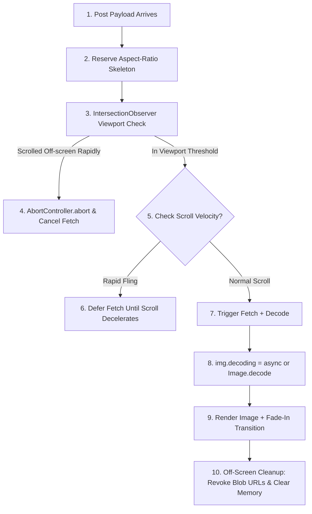

# Deep Dive Study Guide: Infinite List Virtualization & Image Lifecycle Engineering

> **Target Audience**: Staff & Principal Frontend System Design Candidates (Roblox, Meta, Google).  
> **Focus**: Master-class architectural guide on virtualized rendering, dynamic height measurement, scroll positioning, layout strategies, and high-performance image pipeline management.

---

## Part 1: Whiteboard Strategy & Diagram Notes Evaluation

### **Candidate Architectural Diagram Feedback**
Replacing verbose TypeScript interface definitions with structured side notes on your whiteboard diagram is **a top-tier Staff/Principal interview strategy**.

```
+-----------------------------------------------------------------------------------------+
| ADVANTAGES OF BULLETED NOTES VS. TYPE SCHEMAS ON THE WHITEBOARD                         |
+-----------------------------------------------------------------------------------------+
| 1. Time Efficiency : Prevents wasting 5-10 minutes writing boilerplate TS code.        |
| 2. Anchor Memory   : Acts as a checklist for both you and the interviewer (NFRs, edge   |
|                      cases, abort controllers, eviction policies).                     |
| 3. High-Level Focus: Keeps discussion centered on architecture, tradeoffs, and memory    |
|                      rather than syntax details.                                        |
+-----------------------------------------------------------------------------------------+
```

> **Pro Tip**: Verbally state 1-2 core schemas in 15 seconds (e.g., *"My store is normalized as `byIds: Record<id, Post>` and `feedOrder: Array<id>`"*), and rely on visual notes for component contracts (`storageController.putChunk(cursor, data)`).

---

## Part 2: Infinite List Virtualization Strategies

Virtualization (or windowing) renders only the subset of items currently inside (or near) the visible viewport, unmounting or recycling off-screen nodes to maintain a low DOM footprint and steady 60fps / 120fps frame rates.

```
       [ Off-screen Top (Unmounted / Recycled) ]
-------------------------------------------------------  <-- scrollTop - rootMargin
       [ Top Buffer Zone (Prefetched / Pre-rendered) ]
-------------------------------------------------------  <-- Viewport Top (scrollTop)
       |                                             |
       |             VISIBLE VIEWPORT                |
       |          (Active Mounted Nodes)             |
       |                                             |
-------------------------------------------------------  <-- Viewport Bottom (scrollTop + Height)
       [ Bottom Buffer Zone (Prefetched)             ]
-------------------------------------------------------  <-- scrollTop + Height + rootMargin
       [ Off-screen Bottom (Unmounted / Recycled)    ]
```

### **Comparative Layout Strategy Matrix**

| Layout Strategy | How It Works | Advantages | Disadvantages / Failure Modes | Best Used For |
| :--- | :--- | :--- | :--- | :--- |
| **1. Padding Spacers (Document Flow)** | Render visible items in standard layout (`<div>`), with top and bottom `<div>` spacers (or `paddingTop`/`paddingBottom`) setting total scroll height. | Preserves native CSS document flow, simple to implement, accessible out-of-the-box. | Recalculating padding for dynamic height items causes full sibling reflows. | Uniform fixed-height lists or simple dynamic feeds. |
| **2. Absolute Positioning (`translate3d`)** | Parent container is `position: relative`. Items are `position: absolute; transform: translate3d(0, Ypx, 0)`. | **Zero layout reflow** for sibling items; GPU accelerated; allows instant jump to any index via prefix-sum array. | Requires manual layout measurement engine; breaks native document flow. | **Complex dynamic feeds** (Roblox, Instagram, Twitter/X). |
| **3. Recycled DOM Node Pool** | Instantiate a fixed pool of $N$ DOM nodes (e.g., 15 nodes). As items scroll off-screen, shift them to the opposite end and re-bind data. | **Lowest DOM memory footprint**; completely eliminates Garbage Collection (GC) pauses from node creation. | Requires strict component state resets (prevents lingering input state, video state, or image leaks). | **Strict memory constraints** (Low-end mobile, Roblox embedded WebViews). |

---

## Part 3: Dynamic Height Measurement & Scroll Shift Control

In dynamic feeds, post heights are non-deterministic before rendering (variable caption length, user font scaling, dynamic aspect ratios).

### **1. Height Measurement Pipeline**
1. **Aspect-Ratio Box**: Server returns image width/height or aspect ratio. Reserve placeholder box via CSS `aspect-ratio: W / H` or calculated height before image loads.
2. **ResizeObserver Pre-computation**: Attach a `ResizeObserver` to mounted items. When height changes (e.g., text wraps or image finishes loading), update the item's measured height in an internal `measuredHeights` map.
3. **Prefix-Sum Offset Array**: Maintain an array of cumulative item offsets: `itemOffsets[i] = itemOffsets[i-1] + measuredHeights[i-1]`. Total scroll height = `itemOffsets[N]`.
4. **Binary Search for Viewport Bounds**: Use binary search on `itemOffsets` to find `startIndex` (first item where `offset + height >= scrollTop`) and `endIndex` in $O(\log N)$ time.

### **2. Preventing Scroll Jumps (`scrollTop += ΔH`)**
If an item **above the current viewport** resizes (or is measured for the first time), the total content above the user increases by $\Delta H = H_{\text{new}} - H_{\text{old}}$.

```
                     BEFORE RESIZE                                    AFTER RESIZE
             +---------------------------+                   +---------------------------+
             | Item 1 (Height: 100px)    |                   | Item 1 (Expanded: 150px)  |  <-- +50px
             +---------------------------+                   +---------------------------+
  scrollTop  |=== Viewport Top (100px) ==|        scrollTop  |=== Viewport Top (150px) ==|  <-- Adjusted by +50px!
  (100px)    | Item 2 (Visible)          |        (150px)    | Item 2 (STILL Visible)    |  <-- NO SCROLL JUMP!
             +---------------------------+                   +---------------------------+
```

> **Critical Execution Rule**: In React, update `container.scrollTop += ΔH` **synchronously inside `useLayoutEffect`** (before browser paint). If done asynchronously in `useEffect`, the user experiences a 1-frame visual jump.

---

## Part 4: Image Lifecycle & Network Request Engineering



### **1. Scroll Velocity & Network Queue Protection**
When a user flings the feed rapidly, items pass through the `IntersectionObserver` margin for 50ms before leaving.
- **Problem**: 30 concurrent image fetches hit the browser socket pool, stalling API requests.
- **Solution A (`AbortController`)**: Each image component manages an `AbortController`. If `isIntersecting === false` fires before the image completes loading, invoke `abortController.abort()`.
- **Solution B (Scroll Velocity Throttling)**: Calculate scroll velocity $v = \frac{\Delta y}{\Delta t}$. If $v > 1500\text{px/sec}$, set `isFlinging = true` and pause image fetching until `scrollend` fires.

### **2. Async Decoding (`img.decoding = "async"`)**
By default, browser image decoding occurs on the **main thread** during layout/paint, causing frame drops when large WebP/JPEGs render.
- **Fix**: Use `img.decoding = "async"` or explicit JavaScript decoding:
  ```javascript
  const img = new Image();
  img.src = url;
  await img.decode(); // Decodes off the main thread in background pool
  ```

---

## Part 5: Production-Grade Minimal React Code Examples

### **Example 1: Dynamic Height Offset Sync (`useLayoutEffect`)**

```tsx
import React, { useLayoutEffect, useRef, useState } from 'react';

interface VirtualItem {
  id: string;
  height: number;
}

export function DynamicVirtualList({ items }: { items: VirtualItem[] }) {
  const containerRef = useRef<HTMLDivElement>(null);
  const prevHeightsRef = useRef<Map<string, number>>(new Map());

  useLayoutEffect(() => {
    const container = containerRef.current;
    if (!container) return;

    let totalDeltaAbove = 0;
    const viewportTop = container.scrollTop;

    // Measure height shifts for items rendered above the current viewport
    items.forEach((item) => {
      const element = document.getElementById(`post-${item.id}`);
      if (!element) return;

      const currentHeight = element.getBoundingClientRect().height;
      const prevHeight = prevHeightsRef.current.get(item.id) ?? currentHeight;

      const itemTopOffset = element.offsetTop;
      if (itemTopOffset < viewportTop && currentHeight !== prevHeight) {
        totalDeltaAbove += currentHeight - prevHeight;
      }

      prevHeightsRef.current.set(item.id, currentHeight);
    });

    // Synchronously adjust scroll position to prevent layout jump
    if (totalDeltaAbove !== 0) {
      container.scrollTop += totalDeltaAbove;
    }
  });

  return (
    <div ref={containerRef} style={{ overflowY: 'auto', height: '100vh' }}>
      {items.map((item) => (
        <div id={`post-${item.id}`} key={item.id}>
          {/* Post Content */}
        </div>
      ))}
    </div>
  );
}
```

---

### **Example 2: Cancellable Viewport Image Loader**

```tsx
import React, { useState, useEffect, useRef } from 'react';

interface ProgressiveImageProps {
  src: string;
  aspectRatio: number; // e.g. 16 / 9
  alt: string;
}

export function ProgressiveImage({ src, aspectRatio, alt }: ProgressiveImageProps) {
  const [imageSrc, setImageSrc] = useState<string | null>(null);
  const [isLoaded, setIsLoaded] = useState(false);
  const imgRef = useRef<HTMLDivElement>(null);

  useEffect(() => {
    const observer = new IntersectionObserver(
      ([entry]) => {
        if (!entry.isIntersecting) return;

        // Create AbortController for network cancellation
        const controller = new AbortController();
        const img = new Image();
        img.src = src;
        img.decoding = 'async';

        img.decode()
          .then(() => {
            if (!controller.signal.aborted) {
              setImageSrc(src);
              setIsLoaded(true);
            }
          })
          .catch((err) => {
            if (err.name !== 'AbortError') {
              console.error('Image decode failed', err);
            }
          });

        // Cleanup: Abort if item exits viewport before decode completes
        return () => {
          controller.abort();
          img.src = ''; // Force browser network cancellation
        };
      },
      { rootMargin: '200px 0px' } // Prefetch 200px ahead
    );

    if (imgRef.current) observer.observe(imgRef.current);
    return () => observer.disconnect();
  }, [src]);

  return (
    <div
      ref={imgRef}
      style={{
        aspectRatio: `${aspectRatio}`,
        backgroundColor: '#e0e0e0', // Skeleton background
        overflow: 'hidden',
        position: 'relative',
      }}
    >
      {imageSrc && (
        
      )}
    </div>
  );
}
```

---

## Part 6: Comprehensive Tradeoff & Discarded Alternatives Matrix

| Feature / Technique | Chosen Approach | Discarded Alternative | Rationale & Tradeoff |
| :--- | :--- | :--- | :--- |
| **Virtualization Layout** | Absolute Positioning (`translate3d`) + Dynamic ResizeObserver | Document Flow with Margin Padding | Absolute positioning avoids layout reflow for all downstream DOM elements when an item resizes. |
| **Network Prefetching** | `IntersectionObserver` (200px rootMargin) + `AbortController` | Blind prefetching all items in response | Prevents rapid scroll flings from swamping the browser HTTP/2 socket pool. |
| **Image Rasterization** | `img.decoding = "async"` / `Image.decode()` | Synchronous main-thread image decoding | Moves image decompression off the main thread to guarantee 60/120fps scrolling. |
| **Scroll Shift Handling** | `scrollTop += ΔH` in `useLayoutEffect` | Debounced post-paint scroll adjustment | `useLayoutEffect` guarantees layout adjustment happens before paint, eliminating visual jumps. |
| **Offline Cache Storage** | Tiered IndexedDB Page Chunks (`StorageController`) | LocalStorage / In-Memory Array | LocalStorage is synchronous and blocking (5MB limit). In-memory bloats RAM past 30MB budget. |

---

## Part 7: Offline Mode Architecture, Outbox Queue & Reconnection Sync

```mermaid
graph TD
    UserAction[User Action: Create Post / Like / Comment] --> OptUI[1. Optimistic UI Update (Status: PENDING_OFFLINE)]
    OptUI --> Outbox[2. Persist Task in IndexedDB OutboxStore]
    
    Outbox --> NetCheck{3. Is Network Available?}
    NetCheck -->|No / Subway Tunnel| RetainOutbox[Keep in OutboxStore & Queue Event]
    NetCheck -->|Yes / Reconnected| SyncEngine[4. Trigger SyncEngine.flushOutbox]
    
    SyncEngine --> Replay[5. Idempotent HTTP POST Payload with idempotencyKey]
    Replay <--> Server[Server Endpoint]
    
    Server -->|200 OK ACK| Reconcile[6. ID Swap: temp_id -> server_id & Remove from OutboxStore]
    Server -->|4xx / Moderation Reject| Rollback[7. Rollback Optimistic UI State & Show Error Badge]
```

### **1. The Three Pillars of Client Offline Architecture**

1. **Static Asset Tier (Service Worker + Cache API)**:
   - Intercepts image GET requests (`/images/*`).
   - Strategy: **Cache-First with Stale-While-Revalidate**.
   - Storage Cap: Max 100MB bounded LRU cache for image blobs (`URL.createObjectURL()`).
2. **Data Model Tier (`StorageController` + IndexedDB)**:
   - Stores normalized post metadata by cursor page chunks.
   - Enables offline feed reading and back-scroll without network requests.
3. **Mutation Tier (Outbox Queue + Sync Engine)**:
   - Guarantees user interactions (like, comment, post creation) succeed optimistically offline and reliably replay upon reconnection.

### **2. Outbox Task Data Schema**

```typescript
interface OutboxMutationTask {
  mutationId: string;       // Unique UUID for the outbox item
  idempotencyKey: string;   // Client-generated nonce to prevent duplicate server writes
  type: 'CREATE_POST' | 'LIKE_POST' | 'ADD_COMMENT';
  tempEntityId: string;     // Client-side temp ID (e.g. temp_post_999)
  payload: Record<string, any>;
  timestamp: number;        // Local creation epoch timestamp
  retryCount: number;
  status: 'PENDING_OFFLINE' | 'SYNCING' | 'FAILED';
}
```

### **3. Reconnection Synchronization & Conflict Handling**

- **Network Detection**: Combines `navigator.onLine` event listeners with a lightweight HTTP `HEAD /ping` heartbeat to detect true internet connectivity (avoiding captive portal false positives).
- **Sequential Replay**: The `SyncEngine` reads pending tasks from IndexedDB ordered by `timestamp ASC` and sends them with `X-Idempotency-Key` headers.
- **Server ID Reconciliation**:
  - Upon server `201 Created` ACK containing `{ tempId: "temp_post_999", realId: "post_789" }`:
    1. Update normalized store: `byIds["post_789"] = byIds["temp_post_999"]`, `delete byIds["temp_post_999"]`.
    2. Update `feedOrder`: Replace `"temp_post_999"` with `"post_789"`.
    3. Delete task from IndexedDB `OutboxStore`.

