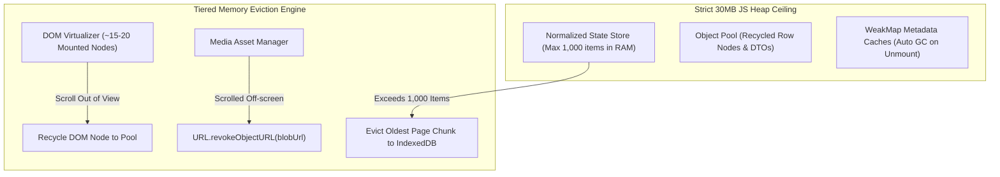

# Deep Dive Study Guide: Memory-Bound Frontend Architecture, Idle Scheduling & Zero-Copy Web Workers

> **Target Audience**: Staff & Principal Frontend System Design Candidates (Roblox, Meta, Google).  
> **Focus**: Master-class architectural guide on enforcing strict client JS heap ceilings (<25–30MB), browser idle scheduling across all engines (including Safari fallbacks), zero-copy Web Worker transfers, object pooling, and eliminating memory leaks.

---

## Part 1: Idle Detection & Frame Deadline Scheduling Across Browsers

To run heavy background tasks (e.g. state eviction, pre-fetching next pages, IndexedDB sync, image processing) without dropping UI frame rates below 60/120fps, work must be scheduled during **browser idle periods**.

```
Frame Budget (16.6ms @ 60Hz)
+----------------------------------------------------+--------------------------+
|  Input Handler -> Animation -> Layout -> Paint     | IDLE PERIOD              |
|  (Main Thread UI Rendering: ~10ms)                | (Remaining Time: ~6.6ms) |
+----------------------------------------------------+--------------------------+
                                                     ^
                                                     | Execute Background Task
```

### **1. `requestIdleCallback` (rIC) vs. Safari Compatibility**

- **Chrome / Edge / Firefox**: Support `window.requestIdleCallback(callback, { timeout: 2000 })`. The browser passes an `IdleDeadline` object with `deadline.timeRemaining()` indicating milliseconds available before the next frame.
- **Safari / WebKit Issue**: **Safari does NOT natively support `requestIdleCallback`!** Calling `window.requestIdleCallback` directly in Safari throws a `TypeError: undefined is not a function`.

### **2. Production Cross-Browser Idle Polyfill (Safari Fallback)**

In production (Roblox, Meta), use a `MessageChannel` macro-task fallback with frame deadline tracking (`performance.now()`):

```typescript
export interface CustomIdleDeadline {
  didTimeout: boolean;
  timeRemaining: () => number;
}

type IdleCallback = (deadline: CustomIdleDeadline) => void;

export class CrossBrowserIdleScheduler {
  private static channel = typeof MessageChannel !== 'undefined' ? new MessageChannel() : null;

  public static schedule(callback: IdleCallback, timeoutMs = 2000): number {
    // 1. Native support (Chrome, Firefox, Edge)
    if (typeof window !== 'undefined' && 'requestIdleCallback' in window) {
      return (window as any).requestIdleCallback(callback, { timeout: timeoutMs });
    }

    // 2. Safari Fallback: MessageChannel macro-task scheduling with 16.6ms frame budget check
    const start = performance.now();
    const frameBudgetMs = 16.6;

    const channel = CrossBrowserIdleScheduler.channel;
    if (channel) {
      channel.port1.onmessage = () => {
        const elapsed = performance.now() - start;
        callback({
          didTimeout: elapsed > timeoutMs,
          timeRemaining: () => Math.max(0, frameBudgetMs - (performance.now() - start)),
        });
      };
      channel.port2.postMessage(null);
      return 1;
    }

    // 3. Ultra-legacy fallback
    return (setTimeout(() => {
      callback({
        didTimeout: false,
        timeRemaining: () => 5,
      }, 0) as unknown as number);
  }

  public static cancel(id: number): void {
    if (typeof window !== 'undefined' && 'cancelIdleCallback' in window) {
      (window as any).cancelIdleCallback(id);
    } else {
      clearTimeout(id);
    }
  }
}
```

---

## Part 2: Offloading Computation to Web Workers Without Copy Overhead

### **1. The Structured Clone Serialization Tax**
By default, calling `worker.postMessage(data)` uses the **Structured Clone Algorithm**.
- **Problem**: Passing a 10MB image array or 10,000 post objects deep-copies the entire data graph. This burns CPU cycles on both main and worker threads, doubling memory usage during the copy and triggering Garbage Collection (GC) frame drops.

```
DEFAULT POSTMESSAGE (Structured Clone = Deep Copy Copy Overhead)
Main Thread [ 10MB ArrayBuffer ] === Copy (10MB) ===> Worker Thread [ New 10MB ArrayBuffer ]
* Peak Memory Usage: 20MB (Doubled!) + CPU Copy Latency *
```

---

### **2. Solution A: Transferable Objects ($O(1)$ Zero-Copy Transfer)**
Transferable objects allow transferring **ownership** of a data buffer instantly ($O(1)$ time complexity) without copying memory bytes.
- **Supported Transferables**: `ArrayBuffer`, `MessagePort`, `ImageBitmap`, `OffscreenCanvas`.
- **Mechanics**: The main thread transfers memory ownership to the worker. Immediately after transfer, the buffer on the main thread becomes **neutered** (byteLength = 0, unusable), and the worker gains direct access to the exact memory address.

```
TRANSFERABLE POSTMESSAGE (Zero-Copy Memory Ownership Transfer)
Main Thread [ ArrayBuffer (Neutered -> 0 bytes) ] === Ownership Transfer (O(1)) ===> Worker Thread [ ArrayBuffer (10MB) ]
* Peak Memory Usage: 10MB (Constant!) + 0ms Copy Latency *
```

```typescript
// Main Thread Example: Processing an Image ArrayBuffer in Web Worker
const response = await fetch('/api/v1/feed/high-res-image.bin');
const buffer = await response.arrayBuffer(); // 15MB ArrayBuffer

console.log('Main thread buffer size before transfer:', buffer.byteLength); // 15,000,000

// Pass buffer in second argument array to transfer ownership (Zero-Copy!)
worker.postMessage({ type: 'PROCESS_IMAGE', payload: buffer }, [buffer]);

console.log('Main thread buffer size after transfer:', buffer.byteLength); // 0 (Neutered!)
```

---

### **3. Solution B: SharedArrayBuffer + Atomics (Shared Memory)**
For ultra-high-throughput applications (e.g. 3D physics, real-time audio/video processing, 100,000 event streams):
- `SharedArrayBuffer` allows main thread and worker threads to read and write to the **exact same memory location** simultaneously without any message passing.
- Synchronized using `Atomics.wait()`, `Atomics.notify()`, and `Atomics.add()` to prevent race conditions.
- *Security Requirement*: Requires Cross-Origin Isolation headers (`Cross-Origin-Opener-Policy: same-origin`, `Cross-Origin-Embedder-Policy: require-corp`).

---

## Part 3: Architecture for Keeping Apps Strictly Memory-Bound (<25–30MB Heap)



### **1. Dual-Layer Eviction Blueprint**

| Layer | Max Capacity | Eviction Strategy | Storage Destination |
| :--- | :--- | :--- | :--- |
| **DOM Layer** | ~15–20 Visible Rows | Recycled Node Pool / Windowing | Unmounted from DOM |
| **JS Central Store** | 1,000 Items | Page-Chunk Eviction | IndexedDB (`StorageController`) |
| **Media Blob Assets** | 100MB Total Cap | LRU Eviction + `URL.revokeObjectURL()` | Disk / Cache API |

---

### **2. Object Pooling to Eliminate Garbage Collection (GC) Stutter**
Creating thousands of temporary objects during scrolling (e.g. `{ id, x, y, status }`) allocates memory in V8's **Young Generation (Scavenge)** heap, triggering GC pauses every few seconds.

```typescript
export class ObjectPool<T> {
  private pool: T[] = [];

  constructor(private factory: () => T, private resetFn: (item: T) => void, initialSize = 50) {
    for (let i = 0; i < initialSize; i++) {
      this.pool.push(this.factory());
    }
  }

  public acquire(): T {
    return this.pool.length > 0 ? this.pool.pop()! : this.factory();
  }

  public release(item: T): void {
    this.resetFn(item);
    if (this.pool.length < 200) { // Bound pool size
      this.pool.push(item);
    }
  }
}
```

---

### **3. Silent Memory Leak Hotspots & Prevention**

#### **Hotspot A: Blob URLs (`URL.createObjectURL`)**
- **Problem**: `URL.createObjectURL(blob)` creates an internal browser mapping that **never** gets garbage-collected automatically until page unload, even if the image element is unmounted.
- **Fix**: Always pair `createObjectURL` with `URL.revokeObjectURL(url)` when the image completes loading or unmounts:
  ```typescript
  const blobUrl = URL.createObjectURL(imageBlob);
  img.src = blobUrl;
  img.onload = () => {
    URL.revokeObjectURL(blobUrl); // Instantly frees memory backing the blob string!
  };
  ```

#### **Hotspot B: Retained DOM Element References in Closures**
- **Problem**: Keeping a reference to a DOM node inside a JS object/array after it has been removed from the document creates a **Detached DOM Tree**, preventing the entire element subtree from being garbage-collected.
- **Fix**: Use `WeakMap<Element, Metadata>` for DOM metadata. When the DOM element is detached, the `WeakMap` entry is automatically garbage-collected.

#### **Hotspot C: Un-cleared Event Listeners & Observers**
- Always clean up `IntersectionObserver`, `ResizeObserver`, and `window.addEventListener` inside component unmount lifecycles (`useEffect` return cleanup callback).

---

## Part 4: Production Memory Monitoring & Telemetry

In production (Chrome / Edge), monitor memory in real-time to alert when heap usage approaches 30MB:

```typescript
export function monitorHeapUsage(): void {
  if (typeof performance !== 'undefined' && (performance as any).memory) {
    const memory = (performance as any).memory;
    const usedHeapMb = memory.usedJSHeapSize / (1024 * 1024);
    const limitHeapMb = memory.jsHeapSizeLimit / (1024 * 1024);

    console.log(`Heap Usage: ${usedHeapMb.toFixed(2)}MB / ${limitHeapMb.toFixed(2)}MB`);

    if (usedHeapMb > 30) {
      console.warn('Memory warning: Heap exceeds 30MB budget. Triggering emergency store eviction...');
      // Trigger emergency store eviction of old page chunks to IndexedDB
    }
  }
}
```

---

## Part 5: Comprehensive Tradeoff & Discarded Alternatives Matrix

| Feature / Pattern | Chosen Approach | Discarded Alternative | Rationale & Principal Tradeoff |
| :--- | :--- | :--- | :--- |
| **Idle Task Scheduling** | `CrossBrowserIdleScheduler` (MessageChannel + Frame Budget Check) | Bare `requestIdleCallback` | Bare `requestIdleCallback` crashes or fails silently in Safari/WebKit. |
| **Worker Data Transfer** | Transferable Objects (`ArrayBuffer`, `ImageBitmap`) | Default `postMessage(data)` Structured Clone | Transferables offer $O(1)$ zero-copy transfer, eliminating structured clone serialization CPU & memory overhead. |
| **Metadata Caching** | `WeakMap<Element, Metadata>` | Standard `Map<string, Metadata>` | `WeakMap` allows key elements to be garbage-collected automatically when unmounted from the DOM. |
| **Media Blob Memory** | Instant `URL.revokeObjectURL(url)` on load | Leaving Blob URLs to browser unload | Un-revoked Blob URLs hold memory references indefinitely, causing severe mobile OOM crashes. |
| **GC Prevention** | Object Pooling for high-frequency DTOs | Instantiating new `{}` objects per frame | Pre-allocated object pools eliminate V8 Scavenger GC pauses during fast scrolling. |
