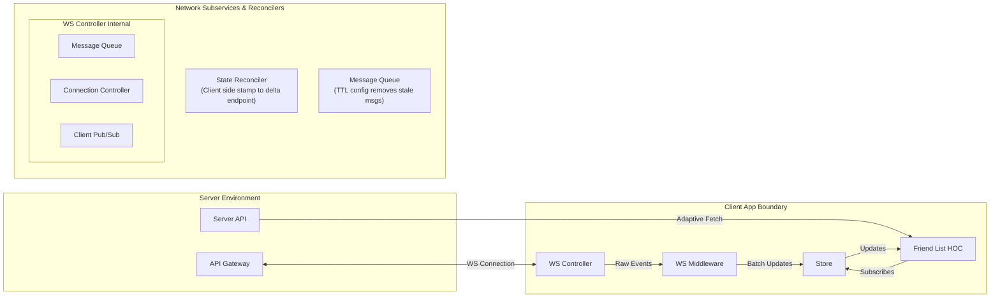

# System Design Study Guide 01: Roblox Persistent Social Presence

> **High-Yield Quick Review (3-Minute Read for Busy Prep)**
> 
> - **Core Problem**: Real-time presence for up to 1,000 friends per user across 50M DAU on mobile (3G) to desktop (Fiber).
> - **Protocol**: WebSockets (WSS) over SSE/Polling. Single bidirectional connection multiplexed for presence, party, and chat.
> - **Network Decoupling**: WS Controller operates as a pure TypeScript Singleton outside React lifecycle. Prevents socket duplicates and unmount/mount connection drops.
> - **State & Render Efficiency**: Immutable Array of Objects. On WS mutation, clone array + mutate target object + **strictly copy old object references** (`newArr[i] = oldArr[i]`).
> - **UI Optimization**: Virtualized List + `React.memo` Friend Row. Prop reference check bails out rendering for 999 unchanged rows.
> - **Network Resilience**: Subway Tunnel scenario handled via client-tracked `last_event_id` hitting a REST Delta endpoint on reconnect. Outgoing actions purged via TTL queue.

---

## I. Candidate Diagram vs. Production Reference Comparison

### Candidate Original Whiteboard Drawing (Mermaid Translation)



---

### Comparative Evaluation Matrix

| Architectural Component | Candidate Whiteboard Sketch | Production Reference Design | Principal-Level Takeaway & Growth Vector |
| :--- | :--- | :--- | :--- |
| **Network & Connection Layer** | Decoupled `WS Controller` with `Connection Controller`, `Message Queue` (TTL), and `Client Pub/Sub`. | Singleton `Connection Manager` managing WSS socket, heartbeats, and client pub/sub outside React. | **S-Tier Nailed**: Excellent recognition that socket management must live outside React. The TTL message queue for offline drops is a Staff-level detail. |
| **Data Ingestion & Batching** | `WS Middleware` receiving raw events and sending `batch updates` to `Store`. | `WS Middleware` receiving events, micro-batching to 16.6ms frame rate (`rAF`), and executing immutable array ref swaps. | **Great**: Good inclusion of batching. Elevate by explicitly specifying 60fps frame scheduling (`requestAnimationFrame`) to prevent event-loop starving. |
| **Data Synchronization** | `Adaptive Fetch` from Server API + `State Reconciler` using client-side timestamp to hit REST delta endpoint. | REST Paginated/Bulk Initial Fetch + `GET /delta?since={timestamp}` endpoint. | **Spot On**: Using client-side timestamps for delta reconciliation is the exact right trade-off vs server-side packet buffers at 50M DAU scale. |
| **Data Schema & Types** | `Friend`, `Status`, `ListItem = Friend & Status`, `FriendList`, `FriendRow`, `delta(client_timestamp)`. | `FriendIdentity` (static) & `FriendPresence` (volatile) separation. | **Very Strong**: You correctly split static user identity (username, avatar) from volatile presence (`game_id`, `place_id`, `onlineStatus`). |
| **UI Component Boundary** | `Friend List HOC` connected to `Store`. | Virtualized List (`react-window`/`FlashList`) + `React.memo` row components. | **Refinement Area**: Replacing an HOC with a Virtualized List + `React.memo` row components prevents full-list re-renders and guarantees $O(1)$ DOM nodes. |

---

## II. Production Reference Architecture Diagram

```mermaid
graph LR
    subgraph Backend Services ["Backend Services"]
        API["API Gateway / WSS"]
        Delta["Delta Sync Endpoint (REST)"]
    end

    subgraph Network Layer ["Network Layer (Singletons - Outside React)"]
        AFM["Adaptive Fetch Manager"]
        subgraph WSC ["WS Controller"]
            CM["Connection Manager / Heartbeat"]
            PS["Client Pub/Sub"]
            MQ["Message Queue w/ TTL"]
        end
    end

    subgraph State Middleware ["State & Batching Layer"]
        WSM["WS Middleware<br/>(Batching & De-duplication)"]
        subgraph Store ["Decoupled Store"]
            State["Friend Array State<br/>[ Array of Friend Objects ]"]
        end
    end

    subgraph UI Layer ["React UI Layer"]
        VL["Virtualized Friend List"]
        FR["Friend Row<br/>(Wrapped in React.memo)"]
    end

    %% Network Flow
    API <-->|Bidirectional WSS| CM
    Delta -->|1. Cold Boot / 2. Delta Reconnect| AFM

    %% Client Data Flow
    AFM -->|Bulk / Paginated Init Payload| WSM
    CM -->|Raw Packet Stream| PS
    PS -->|Subscribed Presence Events| WSM
    MQ -->|Flush Non-Stale Actions on Reconnect| API
    CM -.->|Reconnect Event + last_event_id| AFM

    %% State Mutation Flow
    WSM -->|1. Clone Array<br/>2. Mutate Target Object<br/>3. Copy Unchanged Object Refs| State

    %% Render Flow
    State -->|Pass Array Reference| VL
    VL -->|Pass Item Object Prop| FR
    FR -.->|Shallow Prop Equality Check<br/>Bails Out Unchanged Rows| FR
```



---

## III. Detailed RADIO Breakdown

### 1. Requirements (R)
- **Functional Requirements**:
  - Render persistent presence status (`online`, `offline`, `in_game` with `place_id`) for up to 1,000 friends.
  - Support inline actions: "Join Game", "View Profile", "Unfriend".
  - Graceful degradation across 3G mobile networks up to high-speed desktop fiber.
- **Non-Functional Requirements**:
  - **Scale**: 50M+ DAU, 1,000 friends per list.
  - **Performance**: 60fps scrolling performance, zero main-thread blocking during WebSocket event bursts.
  - **Cross-Platform Target**: Universal JavaScript codebase supporting React Web and React Native (iOS/Android/Mac/Windows).

---

### 2. Architecture & High-Level Design (A)

#### Protocol Selection Matrix

| Protocol | Pros | Cons | Decision |
| :--- | :--- | :--- | :--- |
| **WebSockets (WSS)** | Low latency, low overhead, single bidirectional socket multiplexes presence, chat, and party invites. | Requires heartbeat management and manual reconnect handling. | **SELECTED** |
| **Server-Sent Events (SSE)** | Built-in reconnects, HTTP/2 friendly. | Unidirectional only; requires a separate HTTP pipeline for outgoing client actions (e.g., Join Game). | Discarded |
| **Long Polling** | Fallback compatibility. | High server HTTP overhead, latency spikes, battery drain on mobile. | Discarded |

#### Decoupled Singleton Architecture
- **Network Layer Decoupling**: The `WSController` and `ConnectionManager` are implemented as pure TypeScript singletons.
- **Why**: Placing socket listeners inside React Hooks (`useEffect`) creates race conditions, multiple socket instances on re-renders, and drops connections when components unmount.

---

### 3. Data Model & State Management (D)

#### Schema Design (Client-Server Contract)
Separate immutable identity metadata from high-volatility presence state:

```typescript
// Static Identity (Aggressively cached in IDB / Memory)
type FriendIdentity = {
  id: string;
  username: string;
  avatarUrl: string;
};

// Volatile Presence Delta (Streamed over WS)
type FriendPresence = {
  userId: string;
  status: 'online' | 'offline' | 'in_game';
  placeId?: string;       // Required for inline "Join Game" action
  lastSeenTimestamp: number;
};

// Combined Store Entity
type FriendListItem = FriendIdentity & FriendPresence;
```

#### Reference Preservation Strategy
To achieve $O(1)$ re-render cost for single presence updates:

```typescript
function updateFriendPresence(currentList: FriendListItem[], update: FriendPresence): FriendListItem[] {
  const index = currentList.findIndex(f => f.userId === update.userId);
  if (index === -1) return currentList;

  // 1. Create a shallow copy of the array
  const nextList = [...currentList];

  // 2. Create a new object ONLY for the target friend
  nextList[index] = {
    ...currentList[index],
    ...update
  };

  // 3. Elements at all other indices retain exact reference equality:
  // nextList[k] === currentList[k] for k != index
  return nextList;
}
```

---

### 4. Interface & Rendering (I)

- **Virtualized List**: Uses windowing (`react-window` / `@tanstack/react-virtual` or `FlashList` in React Native) to render only visible items (~15-20 rows out of 1,000).
- **Prop Memoization**: Every row component is wrapped in `React.memo(FriendRow)`.
- **Shallow Comparison Mechanics**: When `nextList` is passed to the list, the list passes `nextList[i]` to `FriendRow`. `React.memo` compares `prevProps.friend === nextProps.friend`. Because reference equality is preserved for 999 rows, React skips re-rendering 999 components instantly.
- **Event Loop Batching**: Incoming WS presence events are queued in a micro-batch buffer and flushed during `requestAnimationFrame` (or `requestIdleCallback`) to prevent layout thrashing under high message throughput.

---

### 5. Optimizations & Edge Cases (O)

#### 1. The Subway Tunnel Scenario (Network Recovery)
- **Problem**: User loses connection in a tunnel for 45 seconds, missing 50 presence updates.
- **Solution**:
  1. The client maintains a `last_event_id` or `client_timestamp`.
  2. Upon WS reconnection, the client issues a `GET /api/v1/presence/delta?since={timestamp}` request to fetch missed deltas.
  3. If the disconnect duration exceeds 5 minutes, the client performs a clean full fetch to clear stale state.

#### 2. Message Queue TTL (Time-To-Live)
- **Problem**: User clicks "Join Game" right as connectivity drops. Without safeguards, the queued action fires 10 minutes later when they reconnect.
- **Solution**: Outgoing actions in the WS offline queue carry a strict 15-second TTL. Expired actions are silently purged with a user toast ("Action timed out due to network drop").

#### 3. Garbage Collection (GC) Protection
- **Problem**: 1,000 WS status updates per minute create thousands of short-lived JS objects, triggering GC spikes (jank/stutter during scrolling).
- **Solution**: WS Middleware uses object pooling and micro-batching to merge multiple presence deltas into a single store tick per frame (16.6ms).

---

## IV. Interviewer Traps & Counter-Strategies

| Interviewer Trap | Hidden Intent | Principal Counter-Strategy |
| :--- | :--- | :--- |
| **"Why not put the WebSocket connection in a custom `useWebSocket` hook?"** | Testing if you rely on React for non-UI infrastructure. | Explain that network connections belong outside the component lifecycle. React component mounts/unmounts shouldn't tear down sockets or trigger duplicate handshakes. |
| **"What happens if 1,000 presence events hit the client in 1 second during a live Roblox event?"** | Testing your understanding of Main Thread blocking & GC pressure. | Introduce **Micro-Batching via `requestAnimationFrame`**. Buffer events in vanilla JS and dispatch one batched update per 16ms frame instead of 1,000 separate store dispatches. |
| **"Why use an Array instead of a Normalized Object Map (`{ [id]: friend }`)?"** | Testing rendering & virtualization knowledge. | Virtualized lists require contiguous numerical indexing (`array[index]`) for $O(1)$ windowing calculations. Using a Map requires running `Object.values(map)` every frame, allocating a new array every render. |
| **"Should the server track every missed WS message for every client?"** | Testing backend/frontend boundary awareness at 50M scale. | Strongly reject server-side packet buffering per socket at 50M DAU (causes server OOM). Shift the tracking responsibility to the client via `last_event_id` + REST Delta Endpoint. |

---

## V. Core Architecture Cheat Sheet

```
+-----------------------------------------------------------------------+
|                       CORE ARCHITECTURAL LAWS                         |
+-----------------------------------------------------------------------+
| 1. NETWORK DECOUPLING : Singletons outside React handle network & WS. |
| 2. REFERENCE EQUALITY : Update array + target item; preserve rest.     |
| 3. BATCHED INGESTION  : Buffer WS payloads to 60fps (16ms ticks).     |
| 4. CLIENT RECOVERY   : Track last_event_id; pull REST delta on drop.  |
| 5. ZERO MAP ALLOC    : Keep arrays for Virtualized List O(1) access.  |
+-----------------------------------------------------------------------+
```
