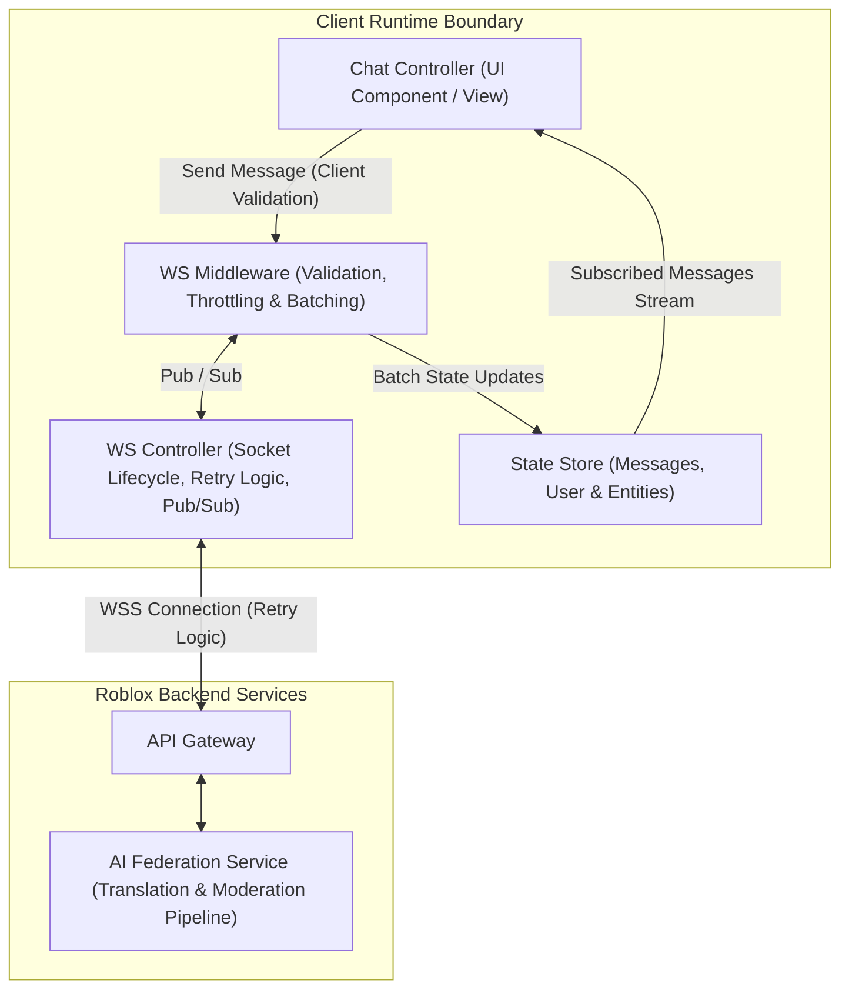
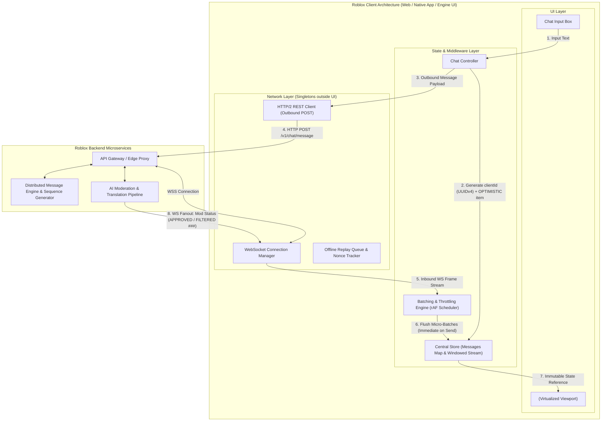
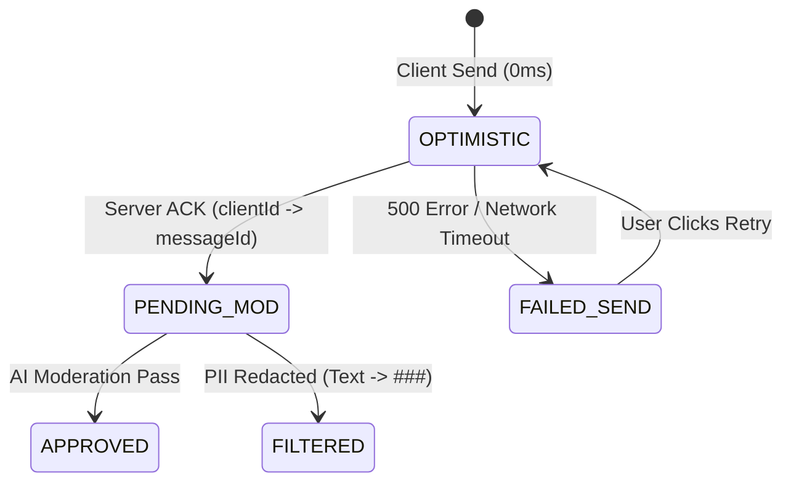

# System Design Study Guide 02: Roblox Chat & Messaging Panel

> **High-Yield Quick Review (3-Minute Read for Busy Prep)**
> 
> - **Core Challenge**: Real-time multi-platform chat for 50M+ DAU with 0ms optimistic UX, real-time safety text moderation (`###` filtering), cross-context embedding (app shell vs 3D game canvas), and reconnection recovery under mobile tunnel drops.
> - **Network Architecture**: Hybrid dual-transport model. Outbound messages sent via HTTP/2 REST (fast edge ACK + independent worker routing); inbound stream received via multiplexed WebSockets (WSS).
> - **Optimistic UI & Moderation State**: Messages are generated with a client-side `clientId` (UUIDv4) and inserted with `OPTIMISTIC` state. Server moderation transforms state to `APPROVED` or `FILTERED` (`###` PII replacement). On error/rejection, message retains viewport space with an in-place failure badge (`FAILED_SEND`), avoiding layout shifts.
> - **Virtualization & GC Memory Cap**: Uses `<InfiniteList />` with viewport windowing (only rendering visible rows) **plus** store-level historical message eviction when exceeding 1,000 items. Maintains client JS/Lua heap memory < 25MB on low-end mobile.
> - **Batching Engine**: Flushes pending WS message buffers immediately on local user send to maintain strict temporal ordering, using adaptive time windows (50ms–100ms) to protect frame rates without delaying live game chat context.

---

## I. Candidate Diagram vs. Production Reference Comparison

### Candidate Original Whiteboard Architecture & Data Model (Mermaid Translation)



---

### Comparative Evaluation Matrix

| Architectural Dimension | Candidate Whiteboard Sketch & Proposals | Production Reference Architecture (Roblox Scale) | Principal-Level Takeaway & Growth Vector |
| :--- | :--- | :--- | :--- |
| **Network Transport** | Single WebSocket Controller for both inbound and outbound traffic with retry logic. | Hybrid Protocol: HTTP/2 REST for outbound message POST (edge ACK) + WSS for multiplexed inbound stream. | **Solid Foundation**: WSS is great for full-duplex streams. Splitting outbound REST POSTs prevents socket write-head-of-line blocking during network congestion. |
| **Optimistic UX & Rollback** | Frontend generates `clientId` for local state append; on failure, removes item or moves to input box with toast. | In-Place Error State: Retains node slot with `FAILED_SEND` badge & retry trigger. Prevents Cumulative Layout Shift (CLS). | **S-Tier Solution**: Candidate's proposal for in-place error state avoids jarring layout jumps when 5 newer messages have already rendered below the failed item. |
| **Moderation Pipeline & Schema** | Base message schema includes `originalText`, `modifiedText`, `reasoning`, and `attachments`. | Multi-State Moderation Engine (`OPTIMISTIC` $\rightarrow$ `PENDING` $\rightarrow$ `APPROVED` / `FILTERED` with `###` PII redaction). | **Strong Schema**: Including both original and modified text enables displaying trust & safety notices to the sender while masking PII from peers. |
| **Batching Execution** | Middleware holds/batches messages on low-end devices; immediately flushes queue when local user sends. | Adaptive Frame-Scheduled Ingestion (`requestAnimationFrame` micro-batches + immediate flush on local send). | **Great Intuition**: Flushing on local send guarantees optimistic message isn't reordered behind stale buffered incoming messages. |
| **Virtualization & Memory** | `<InfiniteList />` viewport windowing + trimming old items from state store when scrolling past threshold. | Dual-Layer Windowing: DOM node recycling in viewport + state store historical eviction with REST page re-fetching. | **Top-Tier Memory Management**: Truncating both the DOM *and* client JS/Lua state store prevents memory bloat (< 25MB heap ceiling). |

---

## II. Production Reference Architecture Diagram



---

## III. Detailed RADIO Framework Breakdown

### 1. Requirements (R)

#### Functional Requirements
1. **Real-Time Text Chat**: Instant bidirectional messaging in app shell and 3D in-game canvas.
2. **Optimistic Updates**: Immediate local append upon send (0ms perceived latency).
3. **Safety & Moderation**: Text filtering for PII/safety (`###` replacement) and translation support.
4. **Rich Attachments**: Game invite cards, deep-links, system notifications, and emojis.
5. **Reconnection & Catch-Up**: Seamless recovery after network drops (e.g. subway tunnels).

#### Non-Functional Requirements (Client-Side Focused)
- **Perceived Send Latency**: 0ms optimistic UI insertion.
- **Scroll & Rendering SLA**: Maintained 60fps/120fps scrolling under 50+ msg/sec spam bursts.
- **Memory & GC Budget**: Client JS/Lua heap memory ceiling < 25-30MB allocated for chat state.
- **Layout Stability**: 0 Cumulative Layout Shift (CLS) during async moderation rollbacks or message failures.

---

### 2. Architecture & High-Level Design (A)

#### Dual-Transport Protocol Strategy
- **Outbound Sending (HTTP/2 REST)**: Outbound message POSTs run over REST endpoints. This guarantees edge ACK microsecond performance, allows CDN/Edge routing directly to Moderation microservices, and prevents socket head-of-line blocking.
- **Inbound Fanout (WebSockets - WSS)**: Inbound events (new messages, moderation state updates, typing indicators) are pushed via a persistent WSS connection.

#### Network Layer Decoupling
The `WSManager` and `RESTClient` are implemented as pure TypeScript/Lua singletons outside the UI component lifecycle. Component mounts/unmounts (e.g., navigating from game lobby into 3D world) do not disconnect or duplicate socket connections.

---

### 3. Data Model & State Schema (D)

#### TypeScript Type Definitions

```typescript
export type UserStatus = 'in_game' | 'in_lobby' | 'away' | 'offline';

export interface User {
  id: string;
  username: string;
  avatarUrl: string;
  status: UserStatus;
}

export type MessageStatus = 
  | 'OPTIMISTIC'       // Rendered locally, awaiting server ACK
  | 'PENDING_MOD'      // Server ACK received, undergoing async AI moderation
  | 'APPROVED'         // Fully verified and delivered
  | 'FILTERED'         // Text modified by moderation (PII replaced with ###)
  | 'FAILED_SEND';     // Network or policy failure; retains slot for retry

export interface AttachmentEntity {
  type: 'image_invite' | 'game_deeplink';
  metaData: {
    gameId?: string;
    placeId?: string;
    previewUrl?: string;
    altText?: string;
  };
}

export interface Message {
  clientId: string;            // Frontend UUIDv4 for local optimistic tracking & rollback
  messageId?: string;          // Backend monotonic sequence ID (assigned post-ACK)
  userId: string;
  originalText: string;        // Text entered by local user
  modifiedText?: string;       // Redacted (###) or translated text
  status: MessageStatus;
  reasoning?: string;          // Trust & safety notice for filtered text
  attachments?: AttachmentEntity[];
  createdAt: number;           // Unix epoch timestamp
  sequenceId?: number;         // Server monotonic index for total ordering
}
```

#### Optimistic UI State Transitions



---

### 4. Interface & Rendering (I)

#### Reusable Virtualized List Component (`<InfiniteList />`)

```tsx
interface InfiniteListProps<T> {
  items: T[];
  pageSize: number;
  fetchMore: (lastItemTimestamp: number) => Promise<void>;
  renderRow: (item: T) => React.ReactNode;
  getItemKey: (item: T) => string;
}

export function InfiniteList<T>({ items, fetchMore, renderRow, getItemKey }: InfiniteListProps<T>) {
  // Virtualized Viewport renders only visible range [startIndex, endIndex]
  // Uses fixed container height + dynamic row height cache
  return (
    <div className="virtualized-scroll-container">
      {/* Dynamic top padding spacer */}
      <div style={{ height: topPaddingHeight }} />
      {visibleItems.map(item => (
        <React.Fragment key={getItemKey(item)}>
          {renderRow(item)}
        </React.Fragment>
      ))}
      {/* Dynamic bottom padding spacer */}
      <div style={{ height: bottomPaddingHeight }} />
    </div>
  );
}
```

#### Temporal Ordering & Ingestion Batching Mechanics
- **Micro-Batch Scheduler**: Incoming WS frames are stored in an array buffer. Every 16.6ms frame (`requestAnimationFrame`), the buffer flushes to the central store.
- **Immediate Local Flush**: When the local user submits a message, the `Batching Engine` **flushes all pending incoming messages instantly** before appending the new optimistic item. This prevents the user's message from being appended out-of-order behind buffered incoming messages.

---

### 5. Optimizations & Edge Cases (O)

#### 1. Dual-Layer Memory & Garbage Collection (GC) Eviction
- **Problem**: Long-running game sessions (2+ hours) accumulate 10,000+ messages in client state, causing JS/Lua heap memory to exceed 100MB and trigger severe GC stutter.
- **Solution**:
  1. **DOM Virtualization**: Only 15–20 visible rows are mounted in the DOM viewport at any time.
  2. **Store Eviction Window**: When chat history exceeds 1,000 items in memory, older items are pruned from the client store. If the user scrolls back up, historical messages are lazily re-fetched via `getMessages(pageSize, oldestTimestamp)`.

#### 2. Clock Skew & Sequence Reconciliation
- **Problem**: Client device clocks vary across global users by up to several seconds/minutes. Relying on `timestamp` for list reconciliation causes out-of-order jumping.
- **Solution**: The backend assigns a monotonic integer `sequenceId` ($S_{id}$) to every message. Client reconciliation uses $S_{id}$ as the primary sorting key, treating timestamps solely as UI display strings.

#### 3. Subway Tunnel Reconnection Catch-Up
- **Problem**: Socket disconnects for 15 seconds during mobile transit. 20 messages sent by peers during the drop are missed.
- **Solution**: Upon socket reconnection, the client issues a `GET /v1/chat/messages?since_seq={last_received_seq_id}` REST request to pull missed delta messages before resuming real-time WS streaming.

---

## IV. Tradeoff Matrix & Discarded Alternatives

| Architectural Choice | Selected Solution | Discarded Alternative | Rationale & Tradeoff Analysis |
| :--- | :--- | :--- | :--- |
| **Transport Model** | Hybrid REST (Outbound) + WSS (Inbound) | Full WebSocket for both Outbound & Inbound | Full WS causes write queue head-of-line blocking during heavy uploads and lacks HTTP edge proxying for moderation services. |
| **Optimistic Failure UX** | In-place failure badge (`FAILED_SEND`) with inline retry | Deleting item & moving text back into input box | Deleting the item causes Cumulative Layout Shift (CLS) when newer messages have already rendered below it. |
| **Sorting / Ordering Key** | Monotonic Server `sequenceId` ($S_{id}$) | Client / Server Unix Timestamps | Client timestamps suffer from device clock skew; server timestamps fail to break microsecond tie-breaks under high volume. |
| **Memory Control** | Dual-Layer Eviction (DOM Virtualization + Store Truncation) | DOM Virtualization only (retaining all history in Store) | Storing 10,000 items in client memory bloats JS heap (> 100MB), triggering GC pauses on mobile devices. |

---

## V. Interviewer Traps & Principal Counter-Strategies

| Interviewer Trap | Hidden Intent | Principal Counter-Strategy |
| :--- | :--- | :--- |
| **"Why not validate text moderation entirely on the client to save server costs?"** | Testing security & COPPA compliance boundaries. | Point out that client-side moderation is easily bypassed via API inspection or reverse engineering. Client heuristics can pre-filter static bad words, but official safety filtering **must** run on isolated server AI pipelines. |
| **"When an optimistic message fails moderation, why not just delete it from the chat array?"** | Testing UI layout stability & Cumulative Layout Shift (CLS) knowledge. | Explain that deleting an item mid-stream triggers jarring CLS for the user when newer messages exist below it. Retaining the item slot with an in-place `FAILED_SEND` badge preserves scroll position and gives explicit UX recovery options. |
| **"Can we use client timestamps to deduplicate historical REST messages and live WS events?"** | Testing understanding of distributed systems and clock skew. | Reject client timestamps due to global device clock drift. Enforce monotonic server sequence IDs ($S_{id}$) and `clientId` nonces for gapless deduplication. |
| **"Why batch incoming WebSocket updates?"** | Testing main-thread rendering performance under high message velocity. | Explain that rendering every incoming socket frame individually causes high React/DOM re-render churn. Batching events into 16.6ms `requestAnimationFrame` ticks protects the 60fps frame budget. |

---

## VI. Core Architecture Cheat Sheet

```
+-----------------------------------------------------------------------+
|                       CORE ARCHITECTURAL LAWS                         |
+-----------------------------------------------------------------------+
| 1. HYBRID TRANSPORT    : REST for outbound POST; WSS for inbound stream.|
| 2. DUAL KEY INDEXING   : clientId (optimistic UI) + sequenceId (server).|
| 3. IN-PLACE FAILURE    : Failed messages stay in slot to prevent CLS.   |
| 4. FLUSH ON SEND       : Local send instantly flushes WS batch buffer.  |
| 5. DUAL EVICTION       : Prune DOM viewport AND trim client state store.|
+-----------------------------------------------------------------------+
```
