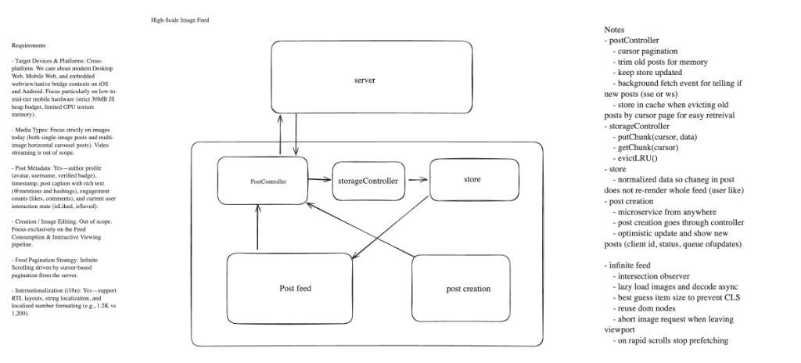
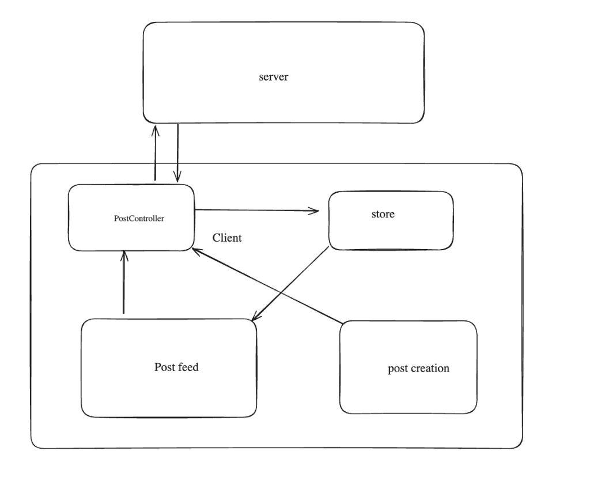
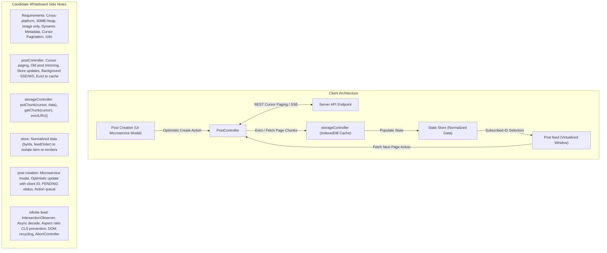
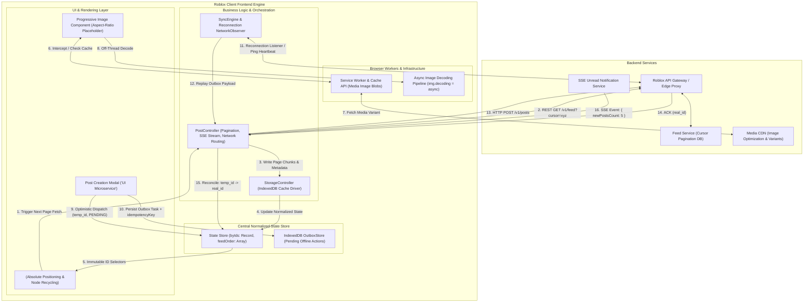

# System Design Study Guide 03: Roblox High-Scale Image Feed

> **High-Yield Quick Review (3-Minute Read for Busy Prep)**
> 
> - **Core Challenge**: Client-side architecture for a Roblox UGC media/image feed targeting cross-platform web and mobile devices with strict performance budgets (< 30MB JS heap budget, 60/120fps smooth scrolling, zero-CLS layout rendering, and resilient offline read/write support).
> - **Network & Fetching Architecture**: REST API with cursor-based pagination for continuous feed loading (`/feed?cursor=xyz&limit=20`) + lightweight Server-Sent Events (SSE) stream for unread feed notification badges ("5 New Posts").
> - **State Store Normalization**: Centralized store organized as `byIds: Record<string, Post>` and `feedOrder: string[]`. Prevents full feed re-renders when individual post engagement states (e.g. `isLiked`, `commentCount`) update.
> - **Virtualized Rendering & CLS Prevention**: Dynamic height viewport windowing with aspect-ratio placeholder containers (`aspect-ratio: W/H`). Synchronous scroll offset adjustment (`scrollTop += ΔH`) inside `useLayoutEffect` prevents layout shifts when upstream items expand.
> - **Media Pipeline & Network Throttling**: Uses `img.decoding = "async"` to offload decompression from the main thread. Prefetches via `IntersectionObserver` with `AbortController` request cancellation on fast scroll exit and scroll velocity throttling ($v > 1,500\text{px/s}$).
> - **Offline Storage & Outbox Replay**: Tiered storage using Service Worker + Cache API for image blobs (100MB LRU limit), IndexedDB `StorageController` for feed page-chunk metadata, and a persistent `OutboxStore` for offline interactions with client-generated `idempotencyKey` and `temp_id -> server_id` reconciliation upon reconnection.

---

## I. Candidate Diagram vs. Production Reference Comparison

### Candidate Original Whiteboard Sketches



*Initial Component Sketch (v1)*:


### Candidate Whiteboard Architecture & Side Notes (Mermaid Translation)

Below is the Mermaid representation of the candidate's final whiteboard diagram and side notes:



---

### Comparative Evaluation Matrix

| Architectural Dimension | Candidate Whiteboard Sketch & Notes | Production Reference Architecture (Roblox Scale) | Principal-Level Takeaway & Growth Vector |
| :--- | :--- | :--- | :--- |
| **Data Layer & Schema Normalization** | Explicit `PostController` with `byIds` / `feedOrder` store normalization. | Normalized Store + Tiered `StorageController` Page Chunking. | **S-Tier Data Architecture**: Separating raw data items into an object map by ID eliminates feed-wide React re-render cascades when likes or comments update. |
| **Offline Storage & Eviction** | Page-chunk eviction to IndexedDB via `storageController` (`putChunk`, `getChunk`, `evictLRU`). | Multi-Tier Storage: Cache API (Image Blobs) + IndexedDB (Metadata Page Chunks) + Persistent Outbox Queue. | **Top-Tier Solution**: Evicting by discrete page chunks (rather than arbitrary node counts) preserves cursor continuity on scroll up. |
| **Optimistic Mutations & Creation** | Post creation as a decoupled "UI Microservice" with `temp_id`, `status`, and action outbox queue. | Persistent Outbox Store with `idempotencyKey` + `SyncEngine` sequential replay & `temp_id -> server_id` swap. | **Solid Production Design**: Treating post creation as an independent UI microservice with optimistic queuing guarantees 0ms user latency. |
| **Virtualization & Layout Stability** | Virtualized list, DOM node recycling, aspect-ratio skeletons for CLS prevention, `scrollTop` delta adjustment. | Absolute Positioning (`translate3d`) + `ResizeObserver` + `useLayoutEffect` `scrollTop += ΔH` sync. | **Deep Rendering Understanding**: Correctly identified that layout shift adjustments for items above the viewport must run synchronously before browser paint. |
| **Media Pipeline & Request Throttling** | `IntersectionObserver`, `img.decoding = "async"`, `AbortController` cancellation on viewport exit, velocity throttling. | Lifecycle Manager: `AbortController` exit abort + `Image.decode()` background rasterization + scroll velocity throttling ($v > 1,500\text{px/s}$). | **Exceptional Network Hygiene**: Canceling in-flight requests on rapid scroll fling prevents saturating the HTTP/2 socket pool. |

---

## II. Production Reference Architecture Diagram



---

## III. Comprehensive RADIO Framework Breakdown

### **R - Requirements & Non-Functional Budgets**

#### **Functional Requirements**
1. **Infinite Feed Consumption**: Scroll continuously through an image-rich media feed driven by server cursor pagination.
2. **Post Details & Metadata**: Display author profile (avatar, handle, badge), timestamp, post caption with rich text (@mentions and hashtags), engagement metrics (like count, comment count), and interactive user states (`isLiked`, `isSaved`).
3. **Optimistic Interactions & Creation**: Allow users to like, comment, and create posts with 0ms visual latency.
4. **Offline Capability**: Enable offline feed reading of cached pages and queueing of offline interactions.

#### **Non-Functional Performance Budgets (Principal Standards)**
- **JS Heap Budget**: $\le 30\text{MB}$ client JS memory footprint on mid-tier mobile hardware.
- **Frame Budget**: 60fps / 120fps smooth scrolling (main thread work $\le 16.6\text{ms}$ per frame).
- **Layout Stability**: 0 Cumulative Layout Shift (CLS $\le 0.05$).
- **Hero Image Loading**: First Contentful Paint (FCP) $\le 0.8\text{s}$, Largest Contentful Paint (LCP) $\le 1.5\text{s}$.

---

### **A - Architecture & Module Boundaries**

1. **`PostController`**: Central orchestrator for API cursor fetching, SSE notification stream listening, and dispatching normalized updates to the store and cache.
2. **`StorageController`**: Abstracted disk storage engine managing IndexedDB page-chunk caching (`getChunk`, `putChunk`, `evictLRU`).
3. **Normalized Store**: Single source of truth split into `byIds: Record<string, Post>` and `feedOrder: string[]`.
4. **`OutboxQueue` & `SyncEngine`**: Manages offline action persistence, network connectivity detection (`navigator.onLine` + ping heartbeat), and idempotent sequential replay upon reconnection.
5. **Service Worker Media Cache**: Handles Cache-First asset retrieval for image blobs (`/images/*`) with a 100MB bounded LRU threshold.

---

### **D - Data Model & TypeScript Schemas**

#### **1. Normalized Store Schema**
```typescript
interface Post {
  id: string;
  author: {
    id: string;
    username: string;
    avatarUrl: string;
    isVerified: boolean;
  };
  imageUrl: string;
  aspectRatio: number; // e.g. 1.777 (16:9) or 1.0 (1:1)
  caption: string;
  likeCount: number;
  commentCount: number;
  isLiked: boolean;
  isSaved: boolean;
  createdAt: number;
  status: 'OPTIMISTIC' | 'SYNCED' | 'FAILED';
}

interface NormalizedFeedState {
  byIds: Record<string, Post>;
  feedOrder: string[]; // List of Post IDs in display sequence
  nextCursor: string | null;
  hasMore: boolean;
  isFetching: boolean;
}
```

#### **2. Outbox Task Schema**
```typescript
interface OutboxMutationTask {
  mutationId: string;       // Unique client UUID
  idempotencyKey: string;   // Monotonic nonce for backend deduplication
  type: 'CREATE_POST' | 'LIKE_POST' | 'ADD_COMMENT';
  tempEntityId: string;     // Client-side temporary ID (temp_uuid_123)
  payload: Record<string, any>;
  timestamp: number;
  status: 'PENDING_OFFLINE' | 'SYNCING' | 'FAILED';
}
```

---

### **I - Interface & Virtualized Rendering Engine**

#### **1. Dynamic Height Virtualization (`translate3d`)**
- Layout is calculated using `position: absolute; transform: translate3d(0, Ypx, 0)` to guarantee zero DOM reflow for sibling elements when an item resizes.
- Container height reserves space upfront using server-provided image aspect ratios (`aspect-ratio: W / H`).

#### **2. Scroll Position Preservation (`scrollTop += ΔH`)**
- When captions or comments expand above the current visible viewport, the container height increases by $\Delta H = H_{\text{new}} - H_{\text{old}}$.
- In React, `container.scrollTop += ΔH` is executed **synchronously inside `useLayoutEffect`** before browser paint, completely eliminating visual layout jumps.

---

### **O - Performance & Offline Optimizations**

1. **Async Image Decoding**: `img.decoding = "async"` or explicit `Image.prototype.decode()` moves image decompression to background threads, eliminating main-thread rasterization frame drops.
2. **`AbortController` Network Cancellation**: When an image scrolled off-screen exits the `IntersectionObserver` threshold before loading completes, `abortController.abort()` cancels the inflight HTTP request.
3. **Scroll Velocity Throttling**: Tracks scroll speed ($v = \frac{\Delta y}{\Delta t}$). Pauses prefetching when $v > 1,500\text{px/s}$ and resumes upon `scrollend`.
4. **Idempotent Reconnection Sync**: Replays offline mutations with `X-Idempotency-Key` headers to ensure backend deduplication even under unreliable cellular reconnects.

---

## IV. Tradeoffs & Discarded Alternatives Matrix

| Architectural Feature | Chosen Approach | Discarded Alternative | Rationale & Principal Tradeoff |
| :--- | :--- | :--- | :--- |
| **Notification Stream** | Server-Sent Events (SSE) + REST GET | Full Duplex WebSocket (WSS) | SSE runs over standard HTTP/2 multiplexing, auto-reconnects natively, and saves mobile battery for read-heavy feeds. |
| **Virtualization Strategy** | Absolute Positioning (`translate3d`) | Native Document Flow with Padding Spacers | Absolute positioning isolates item height changes and prevents full document reflow cascades. |
| **Image Decompression** | `Image.prototype.decode()` / `decoding="async"` | Standard Synchronous `` | Offloads JPEG/WebP decompression from the main thread, preserving 60/120fps scrolling. |
| **Memory Eviction** | Page-Chunk Storage Eviction to IndexedDB | Single-Item Array Slicing | Evicting in discrete page chunks preserves cursor pagination integrity when scrolling back up. |
| **Offline Mutations** | Persistent Outbox Store with Idempotency Keys | Ephemeral In-Memory Retry Queue | In-memory queues lose user writes if the app crashes or the browser tab closes offline. |

---

## V. Interviewer Traps & Principal Counter-Strategies

| Anti-Pattern / Trap | Root Cause / Vulnerability | Principal Counter-Strategy |
| :--- | :--- | :--- |
| **Unbounded Store Heap Bloat** | Virtualizing DOM nodes while allowing JS central state to store 10,000+ items indefinitely. | Dual-Layer Eviction: Trim JS central store array when exceeding 1,000 items and offload evicted page chunks to IndexedDB. |
| **Full Feed Payload WS Streaming** | Pushing raw post JSON payloads continuously over WebSockets. | Lightweight SSE Notifications: Push only `{ unreadCount: 5 }` and let user trigger REST GET on demand. |
| **Deleting Failed Optimistic Items** | Removing a failed optimistic post node from the array. | Retain node slot with `FAILED_SEND` badge and inline retry trigger to prevent Cumulative Layout Shift (CLS). |
| **Layout Shift on Image Load** | Failing to reserve element container dimensions before image load. | Mandate server image dimensions / aspect ratios and enforce CSS `aspect-ratio` bounding boxes. |
